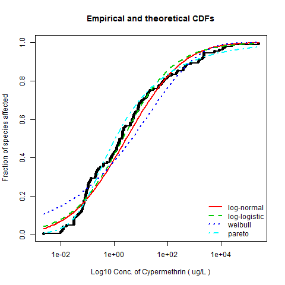
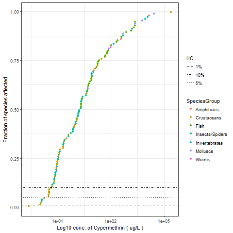

```{r setup, include=FALSE}
library(knitr)
knitr::opts_chunk$set(echo = FALSE)
knitr::opts_chunk$set(comment = NA)

```

## Input parameters
##### chemical

```{r chemical}
params$Chemical

```

##### Endpoint
```{r endpoint, echo=FALSE}
params$Endpoint
  
```

##### SpeciesGroup
```{r SpeciesGroup, echo=FALSE}
params$SpeciesGroup
  
```

##### Effect
```{r effect, echo=FALSE}
params$Effect
  
```

##### OrganismLifestage
```{r OrganismLifestage, echo=FALSE}
params$OrganismLifestage
  
```

##### PesticideType
```{r PesticideType, echo=FALSE}
params$PesticideType
  
```

##### ExposureType
```{r ExposureType, echo=FALSE}
params$ExposureType
  
```

##### ExposureMedia
```{r ExposureMedia, echo=FALSE}
params$ExposureMedia
  
```


##### MediaType
```{r MediaType, echo=FALSE}
params$MediaType
  
```


## Plots

```{r out, echo=FALSE, fig.cap="Goodness of fit", out.width = '100%'}

```

```{r out2, echo=FALSE, fig.cap="Species Sensitivity Distribution", out.width = '100%'}

```


##### Goodness of fit
```{r dfgof, echo=FALSE}
params$outgof
  
```

##### Hazard Concentration
```{r outhc5, echo=FALSE}
params$outhc5
  
```

##### Confidence Intervals
```{r outboot, echo=FALSE}
params$outboot
  
```
  
