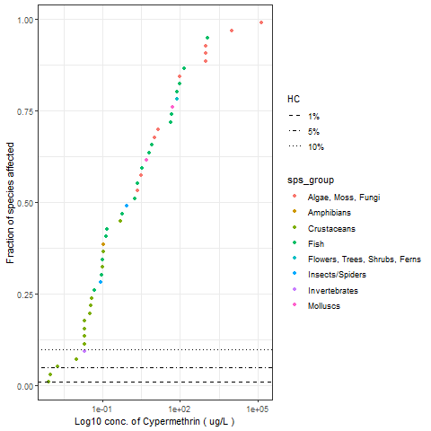

```{r setup, include=FALSE}
library(knitr)
knitr::opts_chunk$set(echo = FALSE)
knitr::opts_chunk$set(comment = NA)

```

## Input parameters
##### Chemical Name

```{r chem_name}
params$chem_name

```

##### Endpoint
```{r endpoint, echo=FALSE}
params$endpoint
  
```

##### Species group
```{r sps_group, echo=FALSE}
params$sps_group
  
```
##### Chemical Type
```{r chem_type, echo=FALSE}
params$chem_type
  
```

##### Effect
```{r effect, echo=FALSE}
params$effect
  
```

##### Analytic Validation
```{r analytic_validation, echo=FALSE}
params$analytic_validation
  
```

##### Test Location
```{r test_location, echo=FALSE}
params$test_location
  
```

##### Organism lifestage
```{r org_lifestage, echo=FALSE}
params$org_lifestage
  
```

##### Exposure Type
```{r exp_type, echo=FALSE}
params$exp_type
  
```

##### Exposure media
```{r exposure_media, echo=FALSE}
params$exposure_media
  
```


##### Media type
```{r media_type, echo=FALSE}
params$media_type
  
```


## Plots

```{r out, echo=FALSE, fig.cap="Fig 1. Goodness of fit"}
knitr::include_graphics("out.png")
```

```{r out2, echo=FALSE, fig.cap="Fig 2. Species Sensitivity Distribution"}

```


##### Goodness of fit
```{r dfgof, echo=FALSE}
params$outgof
  
```

##### Hazard Concentration
```{r outhc5, echo=FALSE}
params$outhc5
  
```

##### Confidence Intervals
```{r outboot, echo=FALSE}
params$outboot
  
```
  
